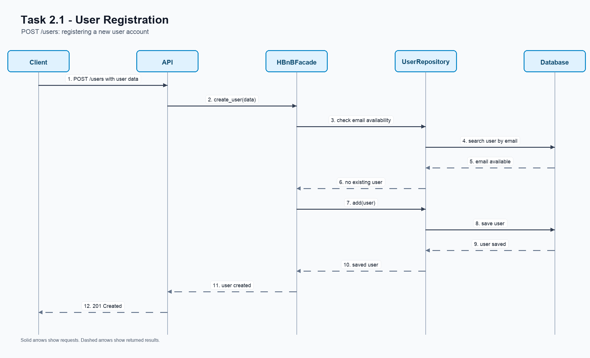
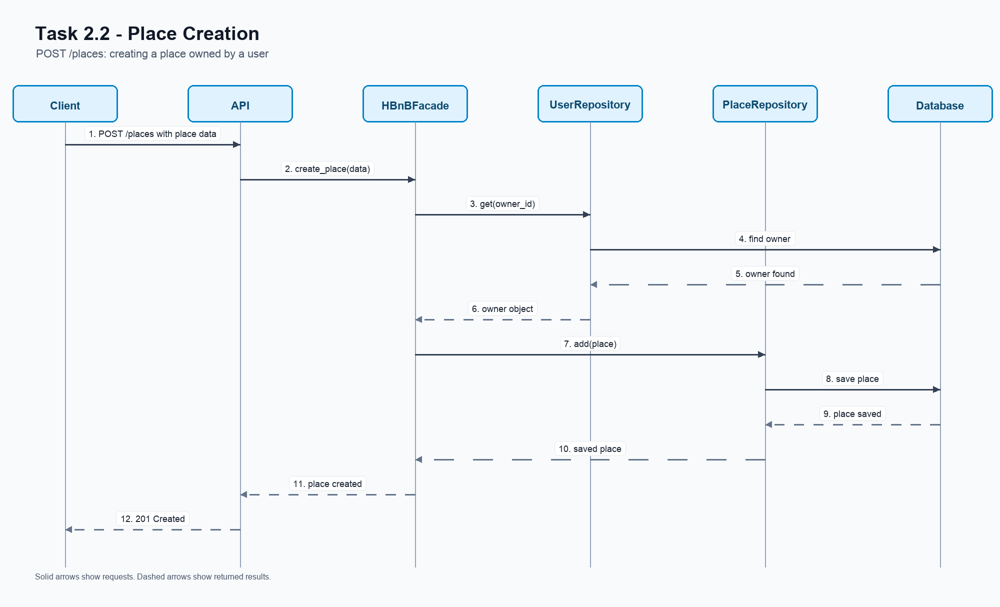
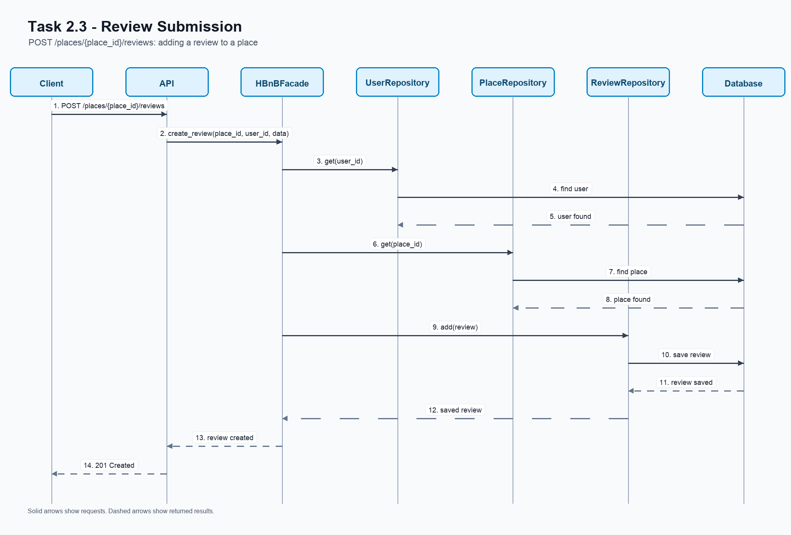
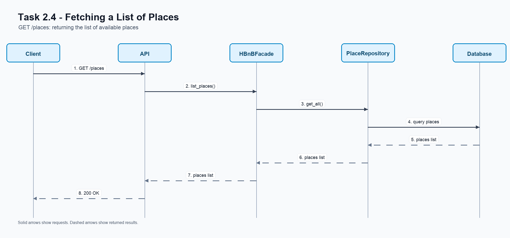

# HBnB - Part 1 Technical Documentation

## Introduction

This document contains the technical documentation for Part 1 of the HBnB project.

HBnB is a simplified AirBnB-like application. The system allows users to register, create places, add amenities, and write reviews.

The purpose of this document is to explain the design of the application before implementation. It includes the main architecture, the business classes, and the flow of important API requests.

This document includes:

- High-Level Package Diagram
- Detailed Class Diagram for the Business Logic Layer
- Sequence Diagrams for API Calls
- Explanatory notes for each diagram

---

## 1. High-Level Architecture

### Purpose

The high-level package diagram shows the general structure of the application.

The application is divided into three layers:

- Presentation Layer
- Business Logic Layer
- Persistence Layer

The `HBnBFacade` is used as the main interface between the API and the internal logic of the application.


### Explanation

The `Presentation Layer` receives requests from the client. This layer represents the API side of the application.

The `Business Logic Layer` contains the main models and rules of the application. The main models are `User`, `Place`, `Review`, and `Amenity`.

The `Persistence Layer` is responsible for saving and retrieving data from storage.

The `HBnBFacade` helps keep the application organized. The API sends requests to the facade instead of accessing the business classes or database directly.

The main flow is:

```text
Client -> API -> HBnBFacade -> Business Logic / Persistence
```

### Design Decision

The layered architecture is used to separate responsibilities.

Each layer has a clear role:

- The API handles requests and responses.
- The business layer handles rules and models.
- The persistence layer handles data storage.

This makes the project easier to understand and easier to change later.

---

## 2. Business Logic Layer

### Purpose

The class diagram shows the main business entities of the HBnB application.

The main classes are:

- `BaseModel`
- `User`
- `Place`
- `Review`
- `Amenity`


### Class Explanation

`BaseModel` is the parent class. It contains the fields shared by all main entities:

- `id`
- `created_at`
- `updated_at`

`User` represents a person using the application. A user can own places and write reviews.

`Place` represents a property listed in the application. Each place has an owner and can have amenities.

`Review` represents feedback written by a user about a place. Each review belongs to one user and one place.

`Amenity` represents a feature that can be added to a place, such as WiFi or parking.

### Relationship Explanation

`User`, `Place`, `Review`, and `Amenity` inherit from `BaseModel`.

This avoids repeating common fields in every class.

One `User` can own many `Place` objects.

One `User` can write many `Review` objects.

One `Place` can contain many `Review` objects.

One `Place` can have many `Amenity` objects.

The relationship between `Place` and `Amenity` is many-to-many because:

- one place can have many amenities
- one amenity can be used by many places

### Design Decision

`BaseModel` is used to keep shared fields in one place.

The classes are separated by responsibility:

- `User` handles user information.
- `Place` handles property information.
- `Review` handles user feedback.
- `Amenity` handles place features.

This keeps the business logic easier to understand.

---

## 3. API Interaction Flow

### Purpose

The sequence diagrams show how API requests move through the application.

They show the interaction between:

- `Client`
- `API`
- `HBnBFacade`
- repositories
- `Database`

Solid arrows show requests or method calls.

Dashed arrows show returned results.

The main flow is usually:

```text
Client -> API -> HBnBFacade -> Repository -> Database
```

Then the result returns back to the client.


---

### 3.1 User Registration

This sequence shows how a new user account is created.

The client sends user data to the API using `POST /users`.



The API sends the request to `HBnBFacade`.

The facade checks if the email is available and then saves the user through `UserRepository`.

The database saves the user and returns a confirmation.

The final response is:

```text
201 Created
```

---

### 3.2 Place Creation

This sequence shows how a user creates a new place listing.

The client sends place data to the API using `POST /places`.



The API sends the request to `HBnBFacade`.

The facade checks if the owner exists through `UserRepository`.

If the owner exists, the facade asks `PlaceRepository` to save the new place.

The final response is:

```text
201 Created
```

---

### 3.3 Review Submission

This sequence shows how a user submits a review for a place.

The client sends review data to the API using `POST /places/{place_id}/reviews`.



The facade checks that the user exists.

The facade also checks that the place exists.

After that, `ReviewRepository` saves the review in the database.

The final response is:

```text
201 Created
```

---

### 3.4 Fetching a List of Places

This sequence shows how the client requests a list of places.

The client sends a `GET /places` request to the API.



The API asks `HBnBFacade` for the list of places.

The facade asks `PlaceRepository` to get the places from the database.

The database returns the list.

The final response is:

```text
200 OK
```

---

## 4. Overall Design Summary

The HBnB application is designed using a layered architecture.

The `Presentation Layer` handles API requests and responses.

The `Business Logic Layer` contains the main classes and rules.

The `Persistence Layer` handles saving and retrieving data.

The `HBnBFacade` connects the API with the internal logic and keeps the communication simple.

The class diagram explains the structure of the business entities.

The sequence diagrams explain how important API calls move through the system.

Together, these diagrams provide a clear blueprint for the implementation phase of the HBnB project.

---

## 5. Final Review Checklist

- The document includes the high-level package diagram.
- The document includes the detailed class diagram.
- The document includes sequence diagrams for four API calls.
- Each diagram has explanatory notes.
- The layered architecture is explained.
- The facade pattern is explained.
- The business entities and relationships are explained.
- The API request flow is explained clearly.
