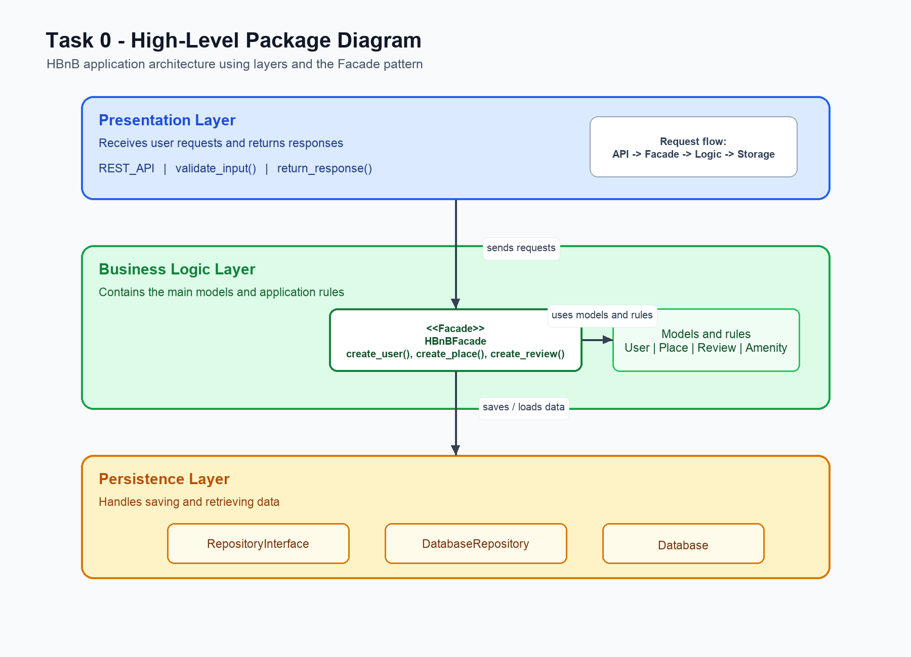
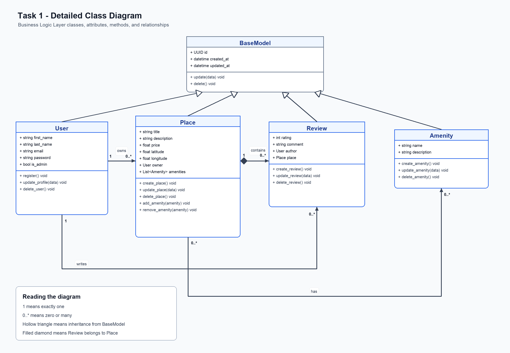
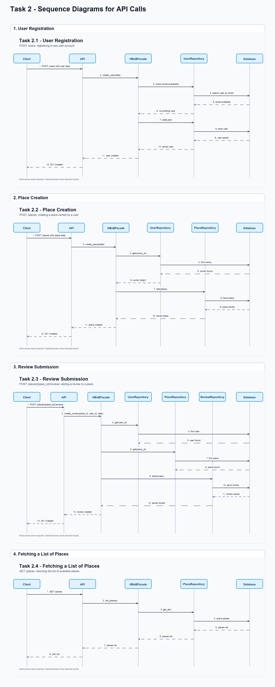

# HBnB - Part 1 UML Documentation

This repository contains the UML documentation for the first part of the HBnB project.

The goal of this part is to explain the design of the application before starting the implementation.

## Contents

- Task 0: High-Level Package Diagram
- Task 1: Detailed Class Diagram for the Business Logic Layer
- Task 2: Sequence Diagrams for API Calls
- Task 3: Documentation Compilation

---

## Task 0 - High-Level Package Diagram

This diagram shows the general architecture of the HBnB application.

The application is divided into three main layers:

- Presentation Layer
- Business Logic Layer
- Persistence Layer

The `HBnBFacade` is used to connect the API with the internal logic of the application.



### Explanation

The `Presentation Layer` receives requests from users and returns responses.

The `Business Logic Layer` contains the main models and rules of the application, such as `User`, `Place`, `Review`, and `Amenity`.

The `Persistence Layer` is responsible for saving and retrieving data.

The `HBnBFacade` acts as a simple interface between the API and the other layers. This keeps the communication clear and avoids making the API access the database directly.

The request flow is:

```text
Presentation Layer -> HBnBFacade -> Business Logic Layer -> Persistence Layer
```

---

## Task 1 - Detailed Class Diagram for Business Logic Layer

This diagram shows the main business classes used in the HBnB application.

The main classes are:

- `BaseModel`
- `User`
- `Place`
- `Review`
- `Amenity`



### Explanation

`BaseModel` is the parent class. It contains fields shared by all main entities:

- `id`
- `created_at`
- `updated_at`

`User`, `Place`, `Review`, and `Amenity` inherit from `BaseModel`.

`User` represents a user of the application. A user can own places and write reviews.

`Place` represents a property listed in the application. Each place belongs to one owner.

`Review` represents feedback written by a user about a place. Each review is connected to one user and one place.

`Amenity` represents a feature that can be added to a place, such as WiFi, parking, or air conditioning.

### Relationship Summary

- One `User` can own many `Place` objects.
- One `User` can write many `Review` objects.
- One `Place` can contain many `Review` objects.
- One `Review` is written by one `User`.
- One `Review` is about one `Place`.
- `Place` and `Amenity` have a many-to-many relationship.

---

## Task 2 - Sequence Diagrams for API Calls

This task shows how different API requests move through the HBnB application.

The diagrams focus on four API calls:

- User Registration
- Place Creation
- Review Submission
- Fetching a List of Places

In these diagrams, the request usually follows this path:

```text
Client -> API -> HBnBFacade -> Repository -> Database
```

Then the result returns back to the client.

Solid arrows show requests or method calls.

Dashed arrows show returned results.



---

### 1. User Registration

This diagram shows how a new user account is created.

The client sends user data to the API using `POST /users`.

The API sends the request to `HBnBFacade`.

The facade asks the repository to check and save the user.

The repository saves the user in the database.

After the user is saved, the response goes back to the client.

Final response:

```text
201 Created
```

---

### 2. Place Creation

This diagram shows how a user creates a new place listing.

The client sends place data to the API using `POST /places`.

The API sends the request to `HBnBFacade`.

The facade checks if the owner exists.

If the owner exists, the facade asks `PlaceRepository` to save the new place.

The place is saved in the database.

Final response:

```text
201 Created
```

---

### 3. Review Submission

This diagram shows how a user submits a review for a place.

The client sends review data to the API.

The API sends the request to `HBnBFacade`.

The facade checks if the user exists.

The facade also checks if the place exists.

After that, the facade asks `ReviewRepository` to save the review.

The review is saved in the database.

Final response:

```text
201 Created
```

---

### 4. Fetching a List of Places

This diagram shows how the client gets a list of places.

The client sends a `GET /places` request to the API.

The API asks `HBnBFacade` for the list of places.

The facade asks `PlaceRepository` to get all places.

`PlaceRepository` queries the database.

The database returns the list of places.

Final response:

```text
200 OK
```

---

## Task 3 - Documentation Compilation

This task combines all previous diagrams and notes into one technical document.

The document includes:

- Introduction
- High-Level Architecture
- Business Logic Layer
- API Interaction Flow
- Overall Design Summary

Files:

- [Technical Documentation - Markdown](HBnB_Part1_Technical_Documentation.md)
- [Technical Documentation - PDF](HBnB_Part1_Technical_Documentation.pdf)

---

## Short Summary

Task 0 explains the big structure of the application.

Task 1 explains the business classes, their attributes, methods, and relationships.

Task 2 explains how API requests move step by step between the layers.

Task 3 combines all diagrams and explanations into one technical document.

Together, these diagrams give a simple first design for the HBnB application.
